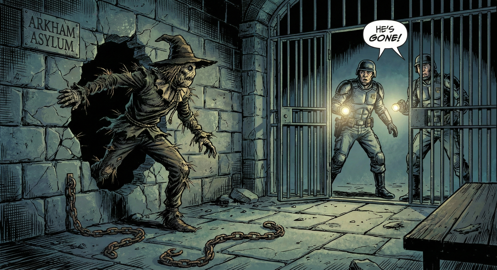
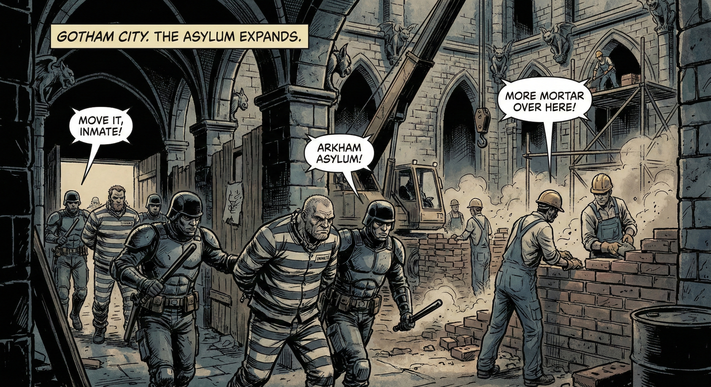

# 🏚️ Arkham Asylum DHT — Sistema de Gestão de Prisioneiros

> *"Ninguém escapa de Arkham... a menos que a DHT permita."*


## 📋 Sobre o Projeto

Este projeto implementa uma **Distributed Hash Table (DHT)** em Python usando a metáfora do **Asilo Arkham** do universo Batman. Em uma DHT, dados são distribuídos entre nós de forma descentralizada usando **Consistent Hashing** — uma técnica que permite adicionar e remover nós sem precisar redistribuir todos os dados.

Aqui, traduzimos cada conceito para o mundo de Gotham: os **nós** são alas do asilo, os **dados** são vilões com fichas criminais, e as operações de inserção, busca e remoção se tornam internar, localizar e registrar fugas. A distribuição dos vilões pelo anel circular garante que nenhum prisioneiro se perca quando o asilo se expande ou sofre ataques.

---

## 🔗 O Anel de Consistent Hashing

A DHT organiza as alas em um **anel circular** de tamanho `2^m`. O hash de cada vilão é calculado com **SHA-1**, gerando uma posição no anel. O vilão é então internado na **primeira ala no sentido horário** cujo ID seja maior ou igual ao hash calculado. Se nenhuma ala satisfaz essa condição, o vilão volta ao início do anel (wrap-around), indo para a primeira ala — exatamente como um relógio que passa da meia-noite e volta para o começo.


```python
class ArkhamDHT:
    """DHT com Consistent Hashing — cada ala cuida de um trecho do anel."""

    def __init__(self, m=4):
        self.size = 2 ** m
        self.alas = []

    def _hash(self, nome):
        """Calcula a posição do vilão no anel."""
        return int(hashlib.sha1(nome.encode()).hexdigest(), 16) % self.size

    def _ala_responsavel(self, nome):
        """Primeira ala com ID >= hash do nome (sentido horário)."""
        h = self._hash(nome)
        for ala in self.alas:
            if ala.ala_id >= h:
                return ala
        return self.alas[0]
```

---

## 🔒 Internar vilão — `internar(nome, ficha)`

Quando um novo vilão é capturado em Gotham, os guardas de Arkham o escoltam até a ala responsável. O sistema calcula o hash do nome do vilão para determinar **automaticamente** em qual ala ele deve ficar. Se o vilão já estava internado, sua ficha criminal é simplesmente atualizada com os novos dados — o Coringa, por exemplo, está sempre escalando seu nível de perigo.


```python
def internar(self, nome, ficha):
    """Interna vilão na ala responsável."""
    self._ala_responsavel(nome).prisioneiros[nome] = ficha
```

---

## 🔍 Localizar vilão — `localizar(nome)`

Os guardas de Arkham precisam frequentemente consultar as fichas criminais dos prisioneiros. A operação `localizar` calcula o hash do nome do vilão, encontra a ala responsável e retorna a ficha completa. Se o vilão nunca foi internado — ou já escapou — o sistema retorna `None`. Como diria o Comissário Gordon: *"Se não está no sistema, não está em Arkham."*


```python
def localizar(self, nome):
    """Localiza vilão. Retorna ficha ou None."""
    if not self.alas:
        return None
    return self._ala_responsavel(nome).prisioneiros.get(nome)
```

---

## 💨 Registrar fuga — `registrar_fuga(nome)`

Nenhum asilo é perfeito — especialmente Arkham. Quando um vilão escapa, `registrar_fuga` remove sua entrada da ala responsável e retorna `True`. Se os guardas tentarem registrar a fuga de alguém que já escapou (ou nunca existiu), a operação retorna `False`. Afinal, não dá para fugir duas vezes do mesmo lugar.



```python
def registrar_fuga(self, nome):
    """Registra fuga de vilão. Retorna True se estava internado."""
    ala = self._ala_responsavel(nome)
    return ala.prisioneiros.pop(nome, None) is not None
```

---

## 🏗️ Construir nova ala — `construir_ala(id)`

Quando a superlotação ameaça a segurança do asilo, a administração constrói uma nova ala. No anel da DHT, o novo nó é inserido na posição correta e os vilões do **sucessor** são reavaliados: aqueles cujo hash agora aponta para a nova ala são **automaticamente transferidos**. Isso garante que a expansão do asilo nunca perca um prisioneiro — apenas redistribui a carga de forma inteligente.



```python
def construir_ala(self, ala_id):
    """Constrói nova ala e redistribui prisioneiros."""
    nova = Ala(ala_id)
    self.alas.append(nova)
    self.alas.sort(key=lambda a: a.ala_id)
    if len(self.alas) > 1:
        suc = self.alas[(self.alas.index(nova) + 1) % len(self.alas)]
        for nome in [n for n in suc.prisioneiros if self._ala_responsavel(n) == nova]:
            nova.prisioneiros[nome] = suc.prisioneiros.pop(nome)
```

---

## 💥 Interditar ala — `interditar_ala(id)`

Quando Bane resolve destruir uma ala inteira de Arkham, todos os vilões precisam ser evacuados antes que os escombros os soterrem. A operação `interditar_ala` transfere **todos os prisioneiros** para a próxima ala no anel (o sucessor) e então remove a ala destruída. Nenhum vilão é perdido no processo — apenas realocado.


```python
def interditar_ala(self, ala_id):
    """Interdita ala e transfere prisioneiros para a próxima."""
    ala = next(a for a in self.alas if a.ala_id == ala_id)
    suc = self.alas[(self.alas.index(ala) + 1) % len(self.alas)]
    suc.prisioneiros.update(ala.prisioneiros)
    self.alas.remove(ala)
```

---

## 🧪 Casos de Teste

Todos os 7 casos de teste estão documentados no arquivo `test_dht.py` e podem ser executados com pytest. Cada teste segue uma estrutura clara de **pré-condição** (estado inicial), **etapas** (ações executadas) e **pós-condição** (resultado esperado):

| # | Teste | Pré-Condição | Etapas | Pós-Condição |
|---|---|---|---|---|
| 1 | **Internar e Localizar** | 3 alas (1, 3, 6), vazio | Internar Coringa e Hera; localizar ambos | Fichas retornadas corretamente |
| 2 | **Fuga do Espantalho** | Espantalho internado | Fuga → localizar → fuga de novo | `True`, `None`, `False` |
| 3 | **Nova Ala (Redistribuição)** | 2 alas (4, 12), 5 vilões | Construir 3ª ala (8); localizar todos | Todos acessíveis, 3 alas |
| 4 | **Ala Interditada (Migração)** | 3 alas (3, 8, 13), 6 vilões | Interditar ala 8; localizar todos | 2 alas, nenhum perdido |
| 5 | **Internação em Massa** | 4 alas, vazio | Internar 20 vilões; localizar todos | 100% encontrados, ≥2 alas |
| 6 | **Atualizar Ficha** | Coringa com `perigo=8` | Reinternar com `perigo=10` | Ficha atualizada |
| 7 | **Vilão Inexistente** | 3 alas, vazio | Localizar "Batman" | `None` |


---

## 🚀 Como Executar

### Pré-requisitos

- Python 3.7+
- pytest

### Instalação

```bash
pip install -r requirements.txt
```

### Executar os testes

```bash
python -m pytest test_dht.py -v
```

### Usar diretamente

```python
from dht import ArkhamDHT

ark = ArkhamDHT(m=3)       # Anel de tamanho 2^3 = 8
ark.construir_ala(1)
ark.construir_ala(3)
ark.construir_ala(6)

ark.internar("Coringa", {"crime": "terrorismo", "perigo": 10})
ark.internar("Hera Venenosa", {"crime": "ecoterrorismo", "perigo": 7})

print(ark.localizar("Coringa"))       # {'crime': 'terrorismo', 'perigo': 10}
print(ark.registrar_fuga("Coringa"))  # True
print(ark.localizar("Coringa"))       # None

ark.status()
```

---

## 📂 Estrutura do Projeto

```
Implementa-o-de-DHT-com-Casos-de-Teste/
├── dht.py              # Implementação da DHT (ArkhamDHT)
├── test_dht.py         # 7 casos de teste com pytest
├── requirements.txt    # Dependências (pytest)
├── README.md           # Este arquivo
└── assets/             # Imagens temáticas do projeto
```
